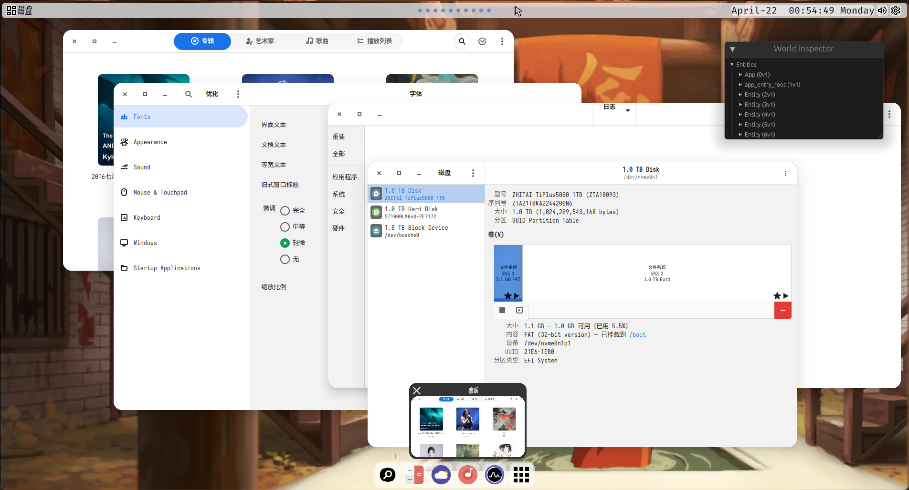
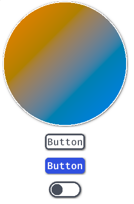
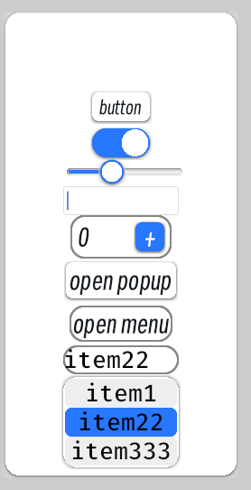
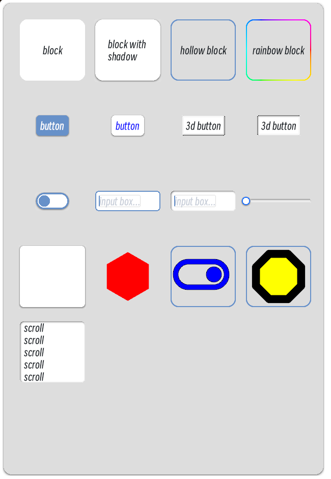

# dway: a wayland compositor base on bevy

# dway: 一个基于bevy引擎的linux wayland混成器

## Screenshot


## Crates

### dway-ui-framework
A responsive gui framework
一个响应式GUI框架

This crate provides a way to create responsive widgets, composable shaders, and some built-in widgets.

#### Combining multiple color tools
```rust
type CircleStyle = ShapeRender<Circle, (Border, Gradient, Shadow)>;

type CheckboxStyle = (
    Transformed<ShapeRender<Circle, (Border, FillColor, Shadow)>, Margins>,
    ShapeRender<RoundedBar, (Border, FillColor, Shadow)>,
);

type ButtonStyle = ShapeRender<RoundedRect, (Border, FillColor, Shadow)>;
```



#### Create new widget type


```rust
/// the prop of the widget
#[derive(Component, Default)]
pub struct Counter;
dway_widget! {
Counter=>
@global(theme: Theme)
@callback{[UiButtonEvent]
    fn inc( In(event): In<UiButtonEvent>, mut query: Query<&mut CounterState>) {
        let Ok(mut state) = query.get_mut(event.receiver) else {return};
        if event.kind == UiButtonEventKind::Released{
            *state.count_mut() += 1;
        }
    }
}
@use_state(count: usize) // after the state is changed, the system will update the ui tree
<UiHollowBlockBundle @style="p-8"> // you can insert any component on the tree
    <UiTextBundle @style="w-64"
        Text=(Text::from_section(state.count().to_string(), TextStyle{ font_size: 32.0, ..theme.default_text_style() }))/>
    <UiHightlightButtonBundle @style="p-4 w-32 h-32 align-items:center justify-content:center" UiButton=(UiButton::new(this_entity, inc)) >
        <UiTextBundle Text=(Text::from_section("+", TextStyle{ font_size: 32.0, color: Color::WHITE, font:theme.default_font() }))/>
    </UiHightlightButtonBundle>
</UiHollowBlockBundle>
}


app.add_plugins(CounterPlugin);

commands.spwan(CounterBundle::default());
```


#### examples




### dway-ui-derive
Provide macros for gui framework

### bevy-relationship
Accessing ECS entity like using in graph database
一个图查询框架

```rust
relationship!(WindowOnWorkspace=>WindowWorkspaceList>-<WindowList);
relationship!(ScreenAttachWorkspace=>ScreenWorkspaceList>-<ScreenList);

graph_query!(
XWindowGraph=>[
    surface=<(&'static Geometry, &'static mut WlSurfacePointerState, Option<&'static PinedWindow> ),With<DWayToplevel>>,
    xwindow=&'static mut XWindow,
    client=Entity,
]=>{
    path=surface-[XWindowAttachSurface]->xwindow,
    seat_path=surface-[ClientHasSurface]->client,
});

graph_query2! {
ScreenGraph=>
window_to_screen=match (window:(&DWayWindow,&GlobalGeometry))-[WindowOnWorkspace]->(w:(&Workspace))<-[ScreenAttachWorkspace]-(s:(&Screen,&GlobalGeometry));
}

```

### dway-tty
Connect gpu and screens on linux tty, and display onto screens.

### dway-server
Connect apps on the desktop

### dway-client-core
Desktop logical module

### dway-ui
The widgets for the wayland compositor

### dway
The top-level crate
