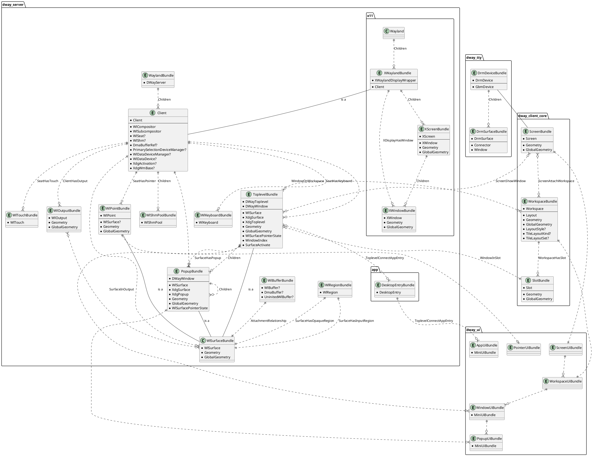

# Chapter 1

```plantuml
@startuml

package dway_server {

entity WaylandBundle {
* DWayServer
}

entity Client {
* Client
--
* WlCompositor
* WlSubcompositor
* WlSeat?
* WlShm?
* DmaBufferRef?
* PrimarySelectionDeviceManager?
* WlDataDeviceManager?
* WlDataDevice?
* XdgActivation?
* XdgWmBase?
}

entity WlOutputBundle{
* WlOutput
* Geometry
* GlobalGeometry
}

Client ||..o{ WlOutputBundle : ClientHasOutput
WlOutputBundle }o..o{ WlSurfaceBundle : SurfaceInOutput

entity WlShmPoolBundle {
* WlShmPool
}

Client ||..o{ WlShmPoolBundle : Children

entity WlRegionBundle{
* WlRegion
}

entity WlBufferBundle{
* WlBuffer?
* DmaBuffer?
* UninitedWlBuffer?
}

class WlSurfaceBundle{
* WlSurface
* Geometry
* GlobalGeometry
}

WlBufferBundle ||..|| WlSurfaceBundle : AttachmentRelationship 

WlRegionBundle ||..|| WlSurfaceBundle : SurfaceHasOpaqueRegion 
WlRegionBundle ||..|| WlSurfaceBundle : SurfaceHasInputRegion 

entity ToplevelBundle{
* DWayToplevel
* DWayWindow
--
* WlSurface
* XdgSurface
* XdgToplevel
* Geometry
* GlobalGeometry
* WlSurfacePointerState
* WindowIndex
* SurfaceActivate
}

entity PopupBundle {
* DWayWindow
--
* WlSurface
* XdgSurface
* XdgPopup
* Geometry
* GlobalGeometry
* WlSurfacePointerState
}

ToplevelBundle ||..o{ PopupBundle : SurfaceHasPopup
ToplevelBundle ||..o{ PopupBundle : Children
PopupBundle ||..o{ PopupBundle : Children

entity WlPointBundle {
* WlPoint
--
* WlSurface?
* Geometry
* GlobalGeometry
}

entity WlKeyboardBundle {
* WlKeyboard
}

entity WlTouchBundle {
* WlTouch
}

Client ||..o{ ToplevelBundle
Client ||..o{ PopupBundle
Client ||..o{ WlPointBundle : SeatHasPointer
Client ||..o{ WlKeyboardBundle : SeatHasKeyboard
Client ||..o{ WlTouchBundle : SeatHasTouch
Client ||..o{ WlSurfaceBundle 

ToplevelBundle --  WlSurfaceBundle : "is a"
PopupBundle  --  WlSurfaceBundle : "is a"
WlPointBundle -- WlSurfaceBundle : "is a"

package x11 {

    entity XWindowBundle {
        * XWindow
        * Geometry
        * GlobalGeometry
    }

    entity XScreenBundle {
        * XScreen
        ---
        * XWindow
        * Geometry
        * GlobalGeometry
    }

    entity XWaylandBundle {
        * XWaylandDisplayWrapper
        ---
        * Client
    }

    XWaylandBundle -- Client : "is a"

    XWaylandBundle ||..o{ XWindowBundle : XDisplayHasWindow
    XWaylandBundle ||..o{ XScreenBundle : Children
    XScreenBundle ||..o{ XWindowBundle : Children
    Wayland ||..o{ XWaylandBundle : Children
}

WaylandBundle ||..o{ Client : Children

package "app" {
	entity DesktopEntryBundle{
		*DesktopEntry
	}
}

ToplevelBundle }o..o{ DesktopEntryBundle : ToplevelConnectAppEntry
}

package dway_tty {
    entity DrmDeviceBundle {
        * DrmDevice
        ---
        * GbmDevice
    }

    entity DrmSurfaceBundle {
        * DrmSurface
        ---
        * Connector
        * Window
    }

    DrmDeviceBundle ||..o{ DrmSurfaceBundle : Children
}

package dway_client_core {

entity WorkspaceBundle {
* Workspace
--
* Layout
* Geometry
* GlobalGeometry
* LayoutStyle?
* TileLayoutKind?
* TileLayoutSet?
}

entity SlotBundle {
* Slot
--
* Geometry
* GlobalGeometry
}
WorkspaceBundle ||..o{ SlotBundle : WorkspaceHasSlot
SlotBundle ||..o{ ToplevelBundle : WindowInSlot

entity ScreenBundle {
* Screen
--
* Geometry
* GlobalGeometry
}
ScreenBundle }o..o{ WorkspaceBundle : ScreenAttachWorkspace
ToplevelBundle }o..o{ WorkspaceBundle : WindowOnWorkspace
ScreenBundle }o..o{ ToplevelBundle : ScreenShowWindow

DrmDeviceBundle -- ScreenBundle

}

package dway_ui {

    entity WindowUiBundle {
    * MiniUiBundle
    }
    ToplevelBundle ||..o{ WindowUiBundle

    entity WorkspaceUiBundle{

    }
    WorkspaceUiBundle ||..o{ WindowUiBundle
    WorkspaceBundle ||..|| WorkspaceUiBundle

    entity ScreenUiBundle {

    }
    ScreenUiBundle ||..o{ WorkspaceUiBundle
    ScreenBundle ||..|| ScreenUiBundle

    entity PopupUiBundle {
    * MiniUiBundle
    }
    PopupBundle ||..o{ PopupUiBundle
    WindowUiBundle ||..o{ PopupUiBundle

    entity AppUiBundle {
    * MiniUiBundle
    }
    DesktopEntryBundle ||..o{ AppUiBundle : ToplevelConnectAppEntry

    entity PointerUiBundle{

    }
    WlPointBundle ||..o| PointerUiBundle

}

@enduml
```
